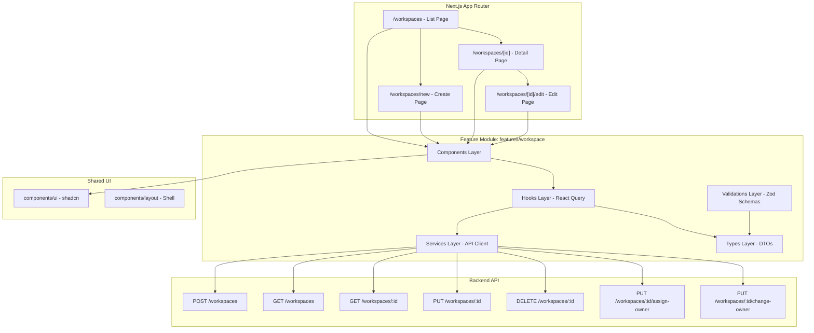
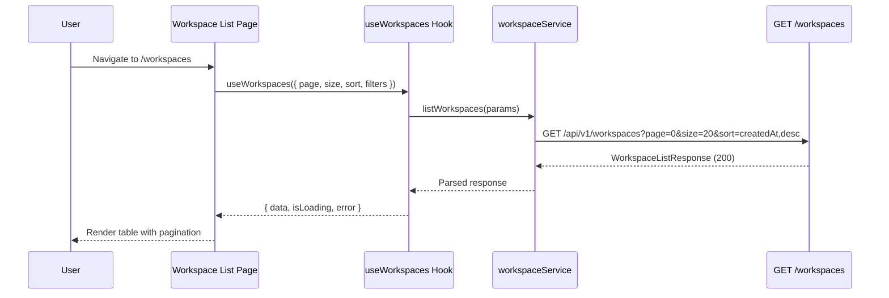
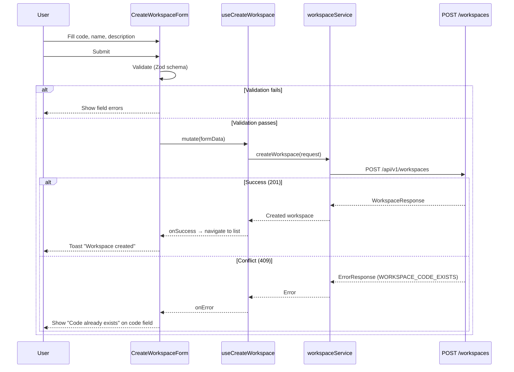
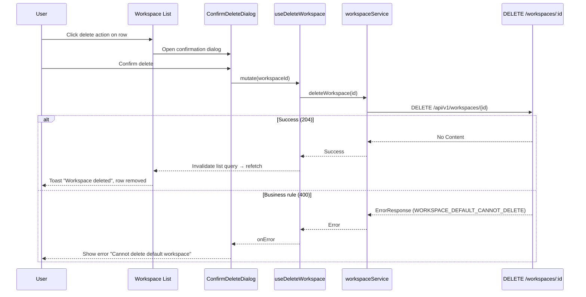

# Design Document: Workspace UI Module

## Overview

The Workspace UI module provides a complete administrative interface for managing workspaces within the ESTORE platform. It integrates with the backend Workspace API (`/api/v1/workspaces`) to enable tenant administrators to create, view, edit, delete, and manage ownership of workspaces. The module is built using Next.js 16 App Router with React 19, shadcn/ui components, and Tailwind CSS 4, following the existing feature-based architecture pattern established by the `drive` module.

The module targets users holding the `ESTORE_TENANT_ADMIN` role and enforces tenant isolation at the API level. All workspace operations produce audit events and follow RFC 7807 error response patterns. The UI must handle paginated lists, form validation matching backend constraints, optimistic UI updates, and clear error messaging for all business rule violations.

## Architecture



## Sequence Diagrams

### Workspace List Flow



### Create Workspace Flow



### Delete Workspace Flow



## Components and Interfaces

### Component Hierarchy

```
features/workspace/
├── components/
│   ├── workspace-list-page.tsx          ← Main list with table, toolbar, pagination
│   ├── workspace-list-toolbar.tsx       ← Search, filter, sort controls
│   ├── workspace-list-table.tsx         ← Data table with row actions
│   ├── workspace-detail-page.tsx        ← Read-only workspace view
│   ├── workspace-create-page.tsx        ← Create form page
│   ├── workspace-edit-page.tsx          ← Edit form page
│   ├── workspace-form.tsx               ← Shared form (create/edit)
│   ├── workspace-delete-dialog.tsx      ← Delete confirmation
│   ├── workspace-owner-dialog.tsx       ← Assign/Change owner dialog
│   └── workspace-status-badge.tsx       ← Default/deletable indicators
├── hooks/
│   ├── use-workspaces.ts                ← List query hook
│   ├── use-workspace.ts                 ← Single workspace query hook
│   ├── use-create-workspace.ts          ← Create mutation hook
│   ├── use-update-workspace.ts          ← Update mutation hook
│   ├── use-delete-workspace.ts          ← Delete mutation hook
│   └── use-workspace-owner.ts           ← Owner assign/change mutation hook
├── services/
│   └── workspace-service.ts             ← API client functions
├── types/
│   └── index.ts                         ← TypeScript types/DTOs
└── validations/
    └── workspace-schemas.ts             ← Zod validation schemas
```

### Route Definitions

| Route | Page Component | Purpose |
|-------|---------------|---------|
| `/workspaces` | `WorkspaceListPage` | Paginated list with search, filter, sort |
| `/workspaces/new` | `WorkspaceCreatePage` | Create workspace form |
| `/workspaces/[id]` | `WorkspaceDetailPage` | Read-only workspace details + audit info |
| `/workspaces/[id]/edit` | `WorkspaceEditPage` | Edit workspace form |

### App Router File Structure

```
app/(with-sidebar)/workspaces/
├── page.tsx                    ← Workspace list
├── new/
│   └── page.tsx               ← Create workspace
└── [id]/
    ├── page.tsx               ← Workspace details
    └── edit/
        └── page.tsx           ← Edit workspace
```

### Reusable Components (from existing UI library)

| Component | Source | Usage |
|-----------|--------|-------|
| `Table`, `TableHeader`, `TableBody`, `TableRow`, `TableCell` | `@/components/ui/table` | Workspace list table |
| `TableSortHead`, `TableRowActions`, `TableFooterBar` | `@/components/ui/table` | Sorting, row actions, pagination bar |
| `Dialog`, `DialogContent`, `DialogHeader`, `DialogFooter` | `@/components/ui/dialog` | Delete confirmation, owner dialogs |
| `AlertDialog` | `@/components/ui/alert-dialog` | Destructive action confirmation |
| `Button` | `@/components/ui/button` | Actions throughout |
| `Input`, `Textarea` | `@/components/ui/input`, `@/components/ui/textarea` | Form fields |
| `Select` | `@/components/ui/select` | Sort/filter dropdowns |
| `Badge` | `@/components/ui/badge` | Status indicators |
| `Skeleton` | `@/components/ui/skeleton` | Loading states |
| `Pagination` | `@/components/ui/pagination` | Table pagination |
| `Tooltip` | `@/components/ui/tooltip` | Action tooltips |
| `Sonner (Toast)` | `@/components/ui/sonner` | Success/error notifications |
| `Card` | `@/components/ui/card` | Detail page sections |
| `Breadcrumb` | `@/components/ui/breadcrumb` | Page navigation context |

## Data Models

### TypeScript Types (mapped from OpenAPI schemas)

```typescript
// === Request Types ===

interface WorkspaceCreateRequest {
  code: string       // 1-50 chars, pattern: ^[A-Za-z0-9_-]+$
  name: string       // 1-255 chars
  description?: string  // max 2000 chars
}

interface WorkspaceUpdateRequest {
  name?: string         // 1-255 chars (at least one field required)
  description?: string  // max 2000 chars
}

interface WorkspaceOwnerRequest {
  ownerId: string  // UUID format
}

// === Response Types ===

interface WorkspaceResponse {
  id: string           // UUID
  code: string
  name: string
  description?: string
  ownerId?: string     // UUID, null if unassigned
  isDefault: boolean
  isDeleteAllowed: boolean
  createdAt: string    // ISO 8601 date-time
  updatedAt?: string   // ISO 8601 date-time
}

interface WorkspaceSummaryResponse {
  id: string           // UUID
  code: string
  name: string
  ownerId?: string     // UUID
  isDefault: boolean
  createdAt: string    // ISO 8601 date-time
}

interface WorkspaceListResponse {
  items: WorkspaceSummaryResponse[]
  page: number         // zero-based
  size: number
  totalElements: number
  totalPages: number
}

// === Error Types ===

interface ApiErrorResponse {
  type: string
  title: string
  status: number
  errorCode: string
  detail: string
}

// === UI State Types ===

type WorkspaceSortField = "name" | "code" | "createdAt"
type SortDirection = "asc" | "desc"

interface WorkspaceListParams {
  page: number
  size: number
  sort?: `${WorkspaceSortField},${SortDirection}`
  code?: string
  name?: string
  ownerId?: string
}
```

### Validation Rules (Zod Schemas)

```typescript
import { z } from "zod"

const workspaceCodeSchema = z
  .string()
  .min(1, "Code is required")
  .max(50, "Code must be 50 characters or less")
  .regex(/^[A-Za-z0-9_-]+$/, "Code can only contain letters, numbers, hyphens, and underscores")

const workspaceNameSchema = z
  .string()
  .min(1, "Name is required")
  .max(255, "Name must be 255 characters or less")

const workspaceDescriptionSchema = z
  .string()
  .max(2000, "Description must be 2000 characters or less")
  .optional()

export const createWorkspaceSchema = z.object({
  code: workspaceCodeSchema,
  name: workspaceNameSchema,
  description: workspaceDescriptionSchema,
})

export const updateWorkspaceSchema = z.object({
  name: workspaceNameSchema,
  description: workspaceDescriptionSchema,
}).refine(
  (data) => data.name !== undefined || data.description !== undefined,
  { message: "At least one field must be provided" }
)

export const workspaceOwnerSchema = z.object({
  ownerId: z.string().uuid("Must be a valid UUID"),
})
```

## Algorithmic Pseudocode

### Workspace List Data Fetching

```typescript
ALGORITHM fetchWorkspaceList(params: WorkspaceListParams)
INPUT: params containing page, size, sort, code, name, ownerId
OUTPUT: WorkspaceListResponse

BEGIN
  // Build query string from non-undefined params
  const queryParams = new URLSearchParams()
  queryParams.set("page", String(params.page))
  queryParams.set("size", String(params.size))
  IF params.sort THEN queryParams.set("sort", params.sort)
  IF params.code THEN queryParams.set("code", params.code)
  IF params.name THEN queryParams.set("name", params.name)
  IF params.ownerId THEN queryParams.set("ownerId", params.ownerId)

  const response = await fetch(`${API_BASE}/workspaces?${queryParams}`, {
    headers: { Authorization: `Bearer ${token}` }
  })

  IF response.status !== 200 THEN
    const error = await response.json() as ApiErrorResponse
    THROW new WorkspaceApiError(error)
  END IF

  RETURN await response.json() as WorkspaceListResponse
END
```

**Preconditions:**
- User is authenticated with valid JWT
- User holds `estore:settings:workspacemanagement:workspace:view` permission
- `params.page >= 0` and `1 <= params.size <= 100`

**Postconditions:**
- Returns paginated list scoped to user's tenant
- `response.items.length <= params.size`
- `response.page === params.page`

### Form Submission with Error Mapping

```typescript
ALGORITHM submitWorkspaceForm(formData, mode: "create" | "edit", workspaceId?: string)
INPUT: validated form data, operation mode, optional workspace ID for edit
OUTPUT: WorkspaceResponse or mapped validation errors

BEGIN
  // Client-side validation already passed (Zod schema)
  TRY
    IF mode === "create" THEN
      result = await workspaceService.createWorkspace(formData)
      showToast("Workspace created successfully")
      navigateTo("/workspaces")
    ELSE
      result = await workspaceService.updateWorkspace(workspaceId!, formData)
      showToast("Workspace updated successfully")
      navigateTo(`/workspaces/${workspaceId}`)
    END IF
    invalidateWorkspaceQueries()
    RETURN result
  CATCH error
    IF error.status === 409 AND error.errorCode === "WORKSPACE_CODE_EXISTS" THEN
      setFieldError("code", "A workspace with this code already exists")
    ELSE IF error.status === 404 THEN
      showToast("Workspace not found", "error")
      navigateTo("/workspaces")
    ELSE IF error.status === 400 THEN
      showToast(error.detail, "error")
    ELSE
      showToast("An unexpected error occurred", "error")
    END IF
  END TRY
END
```

**Preconditions:**
- Form data passes Zod validation
- For edit mode: `workspaceId` is defined and valid UUID

**Postconditions:**
- On success: workspace is created/updated, list cache invalidated, user navigated
- On 409: code field shows inline error
- On other errors: toast notification shown

### Delete with Business Rule Handling

```typescript
ALGORITHM deleteWorkspace(workspaceId: string, workspace: WorkspaceSummaryResponse)
INPUT: workspace ID and workspace summary for pre-checks
OUTPUT: void (success) or error message

BEGIN
  // Pre-flight check (optimistic - server is authoritative)
  IF workspace.isDefault THEN
    showToast("Default workspace cannot be deleted", "error")
    RETURN
  END IF

  // Show confirmation dialog
  confirmed = await showConfirmDialog({
    title: "Delete Workspace",
    description: `Are you sure you want to delete "${workspace.name}"? This action cannot be undone.`,
    confirmLabel: "Delete",
    variant: "destructive"
  })

  IF NOT confirmed THEN RETURN

  TRY
    await workspaceService.deleteWorkspace(workspaceId)
    showToast("Workspace deleted successfully")
    invalidateWorkspaceQueries()
  CATCH error
    IF error.errorCode === "WORKSPACE_DEFAULT_CANNOT_DELETE" THEN
      showToast("Cannot delete the default workspace", "error")
    ELSE IF error.errorCode === "WORKSPACE_DELETE_NOT_ALLOWED" THEN
      showToast("This workspace cannot be deleted", "error")
    ELSE IF error.status === 404 THEN
      showToast("Workspace not found", "error")
      invalidateWorkspaceQueries()
    ELSE
      showToast("Failed to delete workspace", "error")
    END IF
  END TRY
END
```

**Preconditions:**
- User holds `estore:settings:workspacemanagement:workspace:delete` permission
- `workspaceId` is a valid UUID

**Postconditions:**
- On success: workspace is soft-deleted, list refreshed
- On business rule violation: user sees specific error message
- Workspace list state is consistent with server state

## Key Functions with Formal Specifications

### workspaceService.ts — API Client

```typescript
const API_BASE = "/api/v1"

export async function listWorkspaces(params: WorkspaceListParams): Promise<WorkspaceListResponse> {
  const query = buildQueryString(params)
  return apiFetch<WorkspaceListResponse>(`${API_BASE}/workspaces?${query}`)
}

export async function getWorkspace(id: string): Promise<WorkspaceResponse> {
  return apiFetch<WorkspaceResponse>(`${API_BASE}/workspaces/${id}`)
}

export async function createWorkspace(data: WorkspaceCreateRequest): Promise<WorkspaceResponse> {
  return apiFetch<WorkspaceResponse>(`${API_BASE}/workspaces`, {
    method: "POST",
    body: JSON.stringify(data),
  })
}

export async function updateWorkspace(id: string, data: WorkspaceUpdateRequest): Promise<WorkspaceResponse> {
  return apiFetch<WorkspaceResponse>(`${API_BASE}/workspaces/${id}`, {
    method: "PUT",
    body: JSON.stringify(data),
  })
}

export async function deleteWorkspace(id: string): Promise<void> {
  return apiFetch<void>(`${API_BASE}/workspaces/${id}`, {
    method: "DELETE",
  })
}

export async function assignOwner(id: string, data: WorkspaceOwnerRequest): Promise<WorkspaceResponse> {
  return apiFetch<WorkspaceResponse>(`${API_BASE}/workspaces/${id}/assign-owner`, {
    method: "PUT",
    body: JSON.stringify(data),
  })
}

export async function changeOwner(id: string, data: WorkspaceOwnerRequest): Promise<WorkspaceResponse> {
  return apiFetch<WorkspaceResponse>(`${API_BASE}/workspaces/${id}/change-owner`, {
    method: "PUT",
    body: JSON.stringify(data),
  })
}
```

**Preconditions (all functions):**
- Valid JWT token available in auth context
- `id` parameters are valid UUIDs

**Postconditions:**
- On success: returns typed response matching OpenAPI schema
- On error: throws `WorkspaceApiError` with parsed RFC 7807 body
- No side effects beyond the HTTP call

### apiFetch — Base HTTP Utility

```typescript
async function apiFetch<T>(url: string, options?: RequestInit): Promise<T> {
  const token = await getAuthToken()
  const response = await fetch(url, {
    ...options,
    headers: {
      "Content-Type": "application/json",
      Authorization: `Bearer ${token}`,
      ...options?.headers,
    },
  })

  if (!response.ok) {
    const error = await response.json().catch(() => ({
      type: "about:blank",
      title: "Request failed",
      status: response.status,
      errorCode: "UNKNOWN_ERROR",
      detail: response.statusText,
    }))
    throw new WorkspaceApiError(error as ApiErrorResponse)
  }

  if (response.status === 204) return undefined as T
  return response.json() as Promise<T>
}
```

**Preconditions:**
- `url` is a valid API path
- Auth token retrieval function is available

**Postconditions:**
- Non-2xx responses throw `WorkspaceApiError`
- 204 responses return undefined
- Successful responses return parsed JSON

### React Query Hooks

```typescript
// use-workspaces.ts
export function useWorkspaces(params: WorkspaceListParams) {
  return useQuery({
    queryKey: ["workspaces", params],
    queryFn: () => listWorkspaces(params),
    placeholderData: keepPreviousData,  // Smooth pagination transitions
  })
}

// use-workspace.ts
export function useWorkspace(id: string) {
  return useQuery({
    queryKey: ["workspace", id],
    queryFn: () => getWorkspace(id),
    enabled: !!id,
  })
}

// use-create-workspace.ts
export function useCreateWorkspace() {
  const queryClient = useQueryClient()
  return useMutation({
    mutationFn: createWorkspace,
    onSuccess: () => {
      queryClient.invalidateQueries({ queryKey: ["workspaces"] })
    },
  })
}

// use-update-workspace.ts
export function useUpdateWorkspace(id: string) {
  const queryClient = useQueryClient()
  return useMutation({
    mutationFn: (data: WorkspaceUpdateRequest) => updateWorkspace(id, data),
    onSuccess: () => {
      queryClient.invalidateQueries({ queryKey: ["workspaces"] })
      queryClient.invalidateQueries({ queryKey: ["workspace", id] })
    },
  })
}

// use-delete-workspace.ts
export function useDeleteWorkspace() {
  const queryClient = useQueryClient()
  return useMutation({
    mutationFn: deleteWorkspace,
    onSuccess: () => {
      queryClient.invalidateQueries({ queryKey: ["workspaces"] })
    },
  })
}

// use-workspace-owner.ts
export function useAssignOwner(id: string) {
  const queryClient = useQueryClient()
  return useMutation({
    mutationFn: (data: WorkspaceOwnerRequest) => assignOwner(id, data),
    onSuccess: () => {
      queryClient.invalidateQueries({ queryKey: ["workspace", id] })
      queryClient.invalidateQueries({ queryKey: ["workspaces"] })
    },
  })
}

export function useChangeOwner(id: string) {
  const queryClient = useQueryClient()
  return useMutation({
    mutationFn: (data: WorkspaceOwnerRequest) => changeOwner(id, data),
    onSuccess: () => {
      queryClient.invalidateQueries({ queryKey: ["workspace", id] })
      queryClient.invalidateQueries({ queryKey: ["workspaces"] })
    },
  })
}
```

## Example Usage

```typescript
// === Workspace List Page Usage ===
"use client"

import { useState } from "react"
import { useWorkspaces } from "@/features/workspace/hooks/use-workspaces"
import { WorkspaceListTable } from "@/features/workspace/components/workspace-list-table"
import { WorkspaceListToolbar } from "@/features/workspace/components/workspace-list-toolbar"
import type { WorkspaceListParams, WorkspaceSortField, SortDirection } from "@/features/workspace/types"

export function WorkspaceListPage() {
  const [params, setParams] = useState<WorkspaceListParams>({
    page: 0,
    size: 20,
    sort: "createdAt,desc",
  })
  const [searchTerm, setSearchTerm] = useState("")

  const { data, isLoading, error } = useWorkspaces({
    ...params,
    name: searchTerm || undefined,
  })

  return (
    <div className="flex flex-1 flex-col">
      <WorkspaceListToolbar
        searchTerm={searchTerm}
        onSearchChange={setSearchTerm}
        onCreateClick={() => router.push("/workspaces/new")}
      />
      <WorkspaceListTable
        items={data?.items ?? []}
        isLoading={isLoading}
        page={data?.page ?? 0}
        totalPages={data?.totalPages ?? 0}
        totalElements={data?.totalElements ?? 0}
        onPageChange={(page) => setParams((p) => ({ ...p, page }))}
        onSortChange={(sort) => setParams((p) => ({ ...p, sort, page: 0 }))}
      />
    </div>
  )
}

// === Create Workspace Form Usage ===
"use client"

import { useRouter } from "next/navigation"
import { toast } from "sonner"
import { useCreateWorkspace } from "@/features/workspace/hooks/use-create-workspace"
import { WorkspaceForm } from "@/features/workspace/components/workspace-form"
import { createWorkspaceSchema } from "@/features/workspace/validations/workspace-schemas"

export function WorkspaceCreatePage() {
  const router = useRouter()
  const createMutation = useCreateWorkspace()

  const handleSubmit = async (data: z.infer<typeof createWorkspaceSchema>) => {
    try {
      await createMutation.mutateAsync(data)
      toast.success("Workspace created successfully")
      router.push("/workspaces")
    } catch (error) {
      if (error instanceof WorkspaceApiError) {
        if (error.errorCode === "WORKSPACE_CODE_EXISTS") {
          return { code: "A workspace with this code already exists" }
        }
        toast.error(error.detail)
      } else {
        toast.error("An unexpected error occurred")
      }
    }
  }

  return (
    <WorkspaceForm
      mode="create"
      onSubmit={handleSubmit}
      isSubmitting={createMutation.isPending}
      onCancel={() => router.push("/workspaces")}
    />
  )
}

// === Delete Workspace Usage ===
function DeleteWorkspaceAction({ workspace }: { workspace: WorkspaceSummaryResponse }) {
  const deleteMutation = useDeleteWorkspace()
  const [open, setOpen] = useState(false)

  const handleDelete = async () => {
    try {
      await deleteMutation.mutateAsync(workspace.id)
      toast.success("Workspace deleted successfully")
      setOpen(false)
    } catch (error) {
      if (error instanceof WorkspaceApiError) {
        toast.error(error.detail)
      }
    }
  }

  return (
    <AlertDialog open={open} onOpenChange={setOpen}>
      <AlertDialogTrigger asChild>
        <Button variant="ghost" size="icon-sm" disabled={workspace.isDefault || !workspace.isDeleteAllowed}>
          <Trash2 className="size-4" />
        </Button>
      </AlertDialogTrigger>
      <AlertDialogContent>
        <AlertDialogHeader>
          <AlertDialogTitle>Delete Workspace</AlertDialogTitle>
          <AlertDialogDescription>
            Are you sure you want to delete &quot;{workspace.name}&quot;? This action cannot be undone.
          </AlertDialogDescription>
        </AlertDialogHeader>
        <AlertDialogFooter>
          <AlertDialogCancel>Cancel</AlertDialogCancel>
          <AlertDialogAction onClick={handleDelete} variant="destructive">
            Delete
          </AlertDialogAction>
        </AlertDialogFooter>
      </AlertDialogContent>
    </AlertDialog>
  )
}
```

## Correctness Properties

*A property is a characteristic or behavior that should hold true across all valid executions of a system — essentially, a formal statement about what the system should do. Properties serve as the bridge between human-readable specifications and machine-verifiable correctness guarantees.*

### Property 1: Table Row Count Matches API Response

*For any* workspace list API response containing N items, the rendered table SHALL display exactly N data rows.

**Validates: Requirement 1.3**

### Property 2: Form Validation Correctness

*For any* string input to the create workspace form: the code field passes validation if and only if it matches `^[A-Za-z0-9_-]+$` and has length between 1 and 50; the name field passes if and only if it has length between 1 and 255; the description field passes if and only if it is undefined or has length at most 2000.

**Validates: Requirements 6.2, 6.3, 6.4**

### Property 3: Client Validation Precedes API Call

*For any* form submission with invalid data (failing Zod schema validation), no HTTP request SHALL be issued to the backend API.

**Validates: Requirement 6.5**

### Property 4: Error Message Safety

*For any* API error response, the message displayed to the user SHALL be the mapped user-friendly message for known error codes, or a generic fallback for unknown codes, and SHALL never contain raw error codes, stack traces, or technical details.

**Validates: Requirements 10.4, 10.5, 10.6**

### Property 5: Delete Button Protection

*For any* workspace where `isDefault` is true OR `isDeleteAllowed` is false, the delete action button SHALL be disabled in the UI.

**Validates: Requirements 4.2, 4.3**

### Property 6: Pagination Parameter Bounds

*For any* pagination parameters sent to the API, the page value SHALL be greater than or equal to zero and the size value SHALL be between 1 and 100 inclusive.

**Validates: Requirement 1.6**

### Property 7: Sort Parameter Validity

*For any* sort parameter sent to the API, the sort field SHALL be one of "name", "code", or "createdAt" and the direction SHALL be one of "asc" or "desc".

**Validates: Requirement 3.2**

### Property 8: Owner Action Correctness

*For any* workspace displayed on the detail page: if `ownerId` is null, the "Assign Owner" action SHALL be shown and "Change Owner" SHALL be hidden; if `ownerId` is not null, the "Change Owner" action SHALL be shown and "Assign Owner" SHALL be hidden.

**Validates: Requirements 5.5, 5.6**

### Property 9: Permission-Based UI Rendering

*For any* set of user permissions, UI actions (create, edit, delete, assign owner, change owner) SHALL be visible if and only if the user holds the corresponding permission.

**Validates: Requirements 12.1, 12.2, 12.3, 12.4, 12.5**

### Property 10: Owner ID Validation

*For any* string input to the owner assignment form, the ownerId field passes validation if and only if the string is a valid UUID format.

**Validates: Requirement 9.3**

### Property 11: Update Schema Requires At Least One Field

*For any* update workspace form submission, validation SHALL fail if both name and description are undefined or empty.

**Validates: Requirement 7.3**

## Error Handling

### Error Scenario 1: Network Failure

**Condition**: API call fails due to network timeout or connectivity issue
**Response**: Toast notification "Network error. Please check your connection and try again."
**Recovery**: User can retry the action; cached data remains visible (stale-while-revalidate)

### Error Scenario 2: Authentication Expired (401)

**Condition**: JWT token expired during user session
**Response**: Redirect to login page with return URL preserved
**Recovery**: After re-authentication, user returns to previous page

### Error Scenario 3: Permission Denied (403)

**Condition**: User no longer has workspace management permissions
**Response**: Toast "You don't have permission to perform this action"
**Recovery**: UI disables relevant actions; may redirect to dashboard

### Error Scenario 4: Workspace Not Found (404)

**Condition**: Workspace was deleted by another admin between list load and detail view
**Response**: Toast "Workspace not found"; redirect to list page; list cache invalidated
**Recovery**: List refreshes to show current state

### Error Scenario 5: Code Conflict (409)

**Condition**: User creates workspace with code that already exists in tenant
**Response**: Inline form error on `code` field: "A workspace with this code already exists"
**Recovery**: User changes code and resubmits

### Error Scenario 6: Business Rule Violation (400)

**Condition**: Delete default workspace, delete when not allowed, change owner to same owner, etc.
**Response**: Toast with specific message based on `errorCode`:
- `WORKSPACE_DEFAULT_CANNOT_DELETE` → "Default workspace cannot be deleted"
- `WORKSPACE_DELETE_NOT_ALLOWED` → "This workspace cannot be deleted"
- `WORKSPACE_SAME_OWNER` → "New owner must be different from current owner"
- `WORKSPACE_NO_OWNER` → "Cannot change owner — no owner is currently assigned"
- `WORKSPACE_OWNER_EXISTS` → "Owner already assigned — use Change Owner instead"
**Recovery**: User is informed of the constraint and can take corrective action

### Error Code to UI Message Mapping

```typescript
const ERROR_MESSAGES: Record<string, string> = {
  WORKSPACE_NOT_FOUND: "Workspace not found",
  WORKSPACE_CODE_EXISTS: "A workspace with this code already exists",
  WORKSPACE_OWNER_EXISTS: "This workspace already has an owner. Use 'Change Owner' instead.",
  WORKSPACE_NO_OWNER: "Cannot change owner — no owner is currently assigned. Use 'Assign Owner' instead.",
  WORKSPACE_SAME_OWNER: "The new owner must be different from the current owner",
  WORKSPACE_DELETE_NOT_ALLOWED: "This workspace cannot be deleted",
  WORKSPACE_DEFAULT_CANNOT_DELETE: "The default workspace cannot be deleted",
  OWNER_NOT_FOUND: "The selected user was not found",
  INVALID_SORT_FIELD: "Invalid sort field",
}
```

## Testing Strategy

### Unit Testing Approach

- Test Zod validation schemas with valid and invalid inputs
- Test error message mapping utility (errorCode → user-friendly message)
- Test pagination calculation helpers
- Test sort parameter building
- Framework: Vitest

### Property-Based Testing Approach

- **Property**: Any string matching `/^[A-Za-z0-9_-]+$/` with length 1-50 passes code validation
- **Property**: Any WorkspaceListResponse with N items renders N table rows
- **Property**: Pagination controls disable correctly at boundaries (page 0 and last page)

**Property Test Library**: fast-check (with Vitest)

### Integration Testing Approach

- MSW (Mock Service Worker) to mock backend responses
- Test full page flows: list → create → detail → edit → delete
- Test error scenarios with mocked 400/404/409 responses
- Test loading states and skeleton rendering

## Performance Considerations

| Concern | Strategy |
|---------|----------|
| List pagination | Server-side pagination (max 100 items per page) prevents over-fetching |
| Query caching | React Query caches list/detail responses; `staleTime` of 30s reduces redundant requests |
| Smooth transitions | `placeholderData: keepPreviousData` prevents flash of loading state on page change |
| Bundle size | Feature module code-split via Next.js dynamic routes |
| Debounced search | Search input debounced at 300ms to prevent excessive API calls |
| Prefetching | Next.js `<Link prefetch>` on navigation links for instant page transitions |

## Security Considerations

| Concern | Implementation |
|---------|---------------|
| XSS Prevention | React's built-in JSX escaping; no `dangerouslySetInnerHTML` |
| CSRF | JWT Bearer tokens (not cookie-based); no CSRF token needed |
| Input sanitization | Client-side Zod validation + backend `@Sanitize` annotation |
| Mass assignment | TypeScript types ensure only expected fields are sent in requests |
| Token storage | JWT stored in httpOnly cookie or secure memory (not localStorage) |
| Permission enforcement | Delete/edit buttons disabled based on `isDefault`/`isDeleteAllowed` flags; server is authoritative |
| Tenant isolation | No tenant ID in client — backend derives from JWT automatically |

## Dependencies

| Package | Purpose | Status |
|---------|---------|--------|
| `react` / `react-dom` 19 | UI framework | Already installed |
| `next` 16 | App Router, routing, SSR | Already installed |
| `radix-ui` / `shadcn` | Component primitives | Already installed |
| `tailwind-merge` / `clsx` | CSS utilities | Already installed |
| `sonner` | Toast notifications | Already installed |
| `lucide-react` | Icons | Already installed |
| `@tanstack/react-query` | Server state management | **To install** |
| `zod` | Schema validation | **To install** |
| `date-fns` | Date formatting | Already installed |

### State Management Decision

**React Query (TanStack Query)** is chosen over local state or Zustand for workspace data because:
- Workspace data is server state (owned by backend, not client)
- Built-in caching, background refetching, and stale-while-revalidate
- Automatic cache invalidation on mutations
- Loading/error states handled declaratively
- No additional boilerplate for optimistic updates

No global client state store (Zustand/Redux) is needed — workspace module state is entirely server-derived. Local component state handles UI concerns (search term, sort direction, dialog open state).

## Backend Dependencies

### IAM Integration

| Attribute | Value |
|-----------|-------|
| Status | Pending |
| Affected Features | Assign Owner, Change Owner |
| Current Limitation | User existence validation cannot be fully executed until IAM service connectivity is established |

**Impact Assessment:**
- ✅ UI can be implemented in full (dialogs, forms, validation, error handling)
- ✅ API integration layer can be implemented (service functions, hooks, types)
- ✅ Client-side validation (UUID format check) works independently
- ⚠️ End-to-end testing of owner assignment is deferred until IAM integration is completed
- ⚠️ `OWNER_NOT_FOUND` error code testing requires IAM service availability

**Implementation Approach:**
- Build complete Owner Management UI components as designed
- Implement full API service layer with proper error handling
- Mark integration test cases with `TODO: Requires IAM integration` annotations
- Use mock responses in development/testing where IAM validation would occur
- No architectural changes needed — the design supports graceful degradation

## Permissions Mapping

| Backend Permission | UI Behavior |
|-------------------|-------------|
| `workspace:view` | List page accessible; detail page accessible |
| `workspace:create` | "New Workspace" button visible and enabled |
| `workspace:update` | "Edit" action available on row/detail page |
| `workspace:delete` | "Delete" action available (further gated by `isDeleteAllowed` and `isDefault`) |
| `workspace:assign_owner` | "Assign Owner" action visible when `ownerId` is null |
| `workspace:change_owner` | "Change Owner" action visible when `ownerId` is set |

**Note**: Permission-based UI rendering is a progressive enhancement. The server enforces all access control — the UI hides actions only to improve UX, not for security.

## Folder Structure

```
src/features/workspace/
├── components/
│   ├── workspace-list-page.tsx          ← Full list page with toolbar + table
│   ├── workspace-list-toolbar.tsx       ← Search input, filters, "New" button
│   ├── workspace-list-table.tsx         ← Table with sorting, row actions, pagination
│   ├── workspace-detail-page.tsx        ← Read-only detail view with audit info
│   ├── workspace-create-page.tsx        ← Page wrapper for create form
│   ├── workspace-edit-page.tsx          ← Page wrapper for edit form
│   ├── workspace-form.tsx               ← Shared form component (create + edit modes)
│   ├── workspace-delete-dialog.tsx      ← AlertDialog for delete confirmation
│   ├── workspace-owner-dialog.tsx       ← Dialog for assign/change owner
│   └── workspace-status-badge.tsx       ← Badge showing Default/Protected status
├── hooks/
│   ├── use-workspaces.ts                ← useQuery for list endpoint
│   ├── use-workspace.ts                 ← useQuery for single workspace
│   ├── use-create-workspace.ts          ← useMutation for POST
│   ├── use-update-workspace.ts          ← useMutation for PUT
│   ├── use-delete-workspace.ts          ← useMutation for DELETE
│   └── use-workspace-owner.ts           ← useMutation for assign/change owner
├── services/
│   └── workspace-service.ts             ← Typed fetch wrappers for all endpoints
├── types/
│   └── index.ts                         ← All TypeScript interfaces and types
└── validations/
    └── workspace-schemas.ts             ← Zod schemas for form validation
```

## Navigation Integration

The sidebar navigation will be updated to show workspace management under an admin section:

```typescript
// Updated sidebar-nav.ts entry for workspace admin
{
  label: "Workspaces",
  href: "/workspaces",
  icon: HardDrive,
  // children will be dynamically loaded from API instead of hardcoded
}
```

The current hardcoded workspace children (Finance, Human Resource, Marketing) will be replaced by dynamic workspace listing from the API, with the workspace management page as the main `/workspaces` route.

## Loading States

| State | Component | Visual |
|-------|-----------|--------|
| List loading (initial) | `WorkspaceListTable` | 5 skeleton rows with shimmer |
| List loading (page change) | `WorkspaceListTable` | Previous data shown (keepPreviousData), subtle loading indicator |
| Detail loading | `WorkspaceDetailPage` | Card skeleton with field placeholders |
| Form submitting | `WorkspaceForm` | Submit button shows spinner, form disabled |
| Delete in progress | `WorkspaceDeleteDialog` | Delete button shows spinner, cancel disabled |
| Search debouncing | `WorkspaceListToolbar` | Subtle spinner in search input |

## Screen Mockups (Component Layout)

### Workspace List Page

```
┌─────────────────────────────────────────────────────────────┐
│ Breadcrumb: Settings > Workspace Management                  │
├─────────────────────────────────────────────────────────────┤
│ ┌─ Toolbar ───────────────────────────────────────────────┐ │
│ │ [🔍 Search workspaces...    ]  [Filter ▼]  [+ New]     │ │
│ └─────────────────────────────────────────────────────────┘ │
│ ┌─ Table ─────────────────────────────────────────────────┐ │
│ │ ☐ │ Code ↑  │ Name        │ Owner   │ Created    │ ··· │ │
│ │───│─────────│─────────────│─────────│────────────│─────│ │
│ │ ☐ │ FIN     │ Finance     │ J. Doe  │ 2024-01-15 │ ··· │ │
│ │ ☐ │ HR      │ Human Res.  │ —       │ 2024-01-10 │ ··· │ │
│ │ ☐ │ MKT     │ Marketing   │ A. Smith│ 2024-01-08 │ ··· │ │
│ │ ☐ │ DEFAULT │ Default  🏷 │ —       │ 2024-01-01 │ ··· │ │
│ └─────────────────────────────────────────────────────────┘ │
│ ┌─ Footer Bar ────────────────────────────────────────────┐ │
│ │ Showing 1-4 of 4          ◀ 1 of 1 ▶   Go to [ ] [Go] │ │
│ └─────────────────────────────────────────────────────────┘ │
└─────────────────────────────────────────────────────────────┘
```

### Workspace Create/Edit Form

```
┌─────────────────────────────────────────────────────────────┐
│ Breadcrumb: Settings > Workspaces > New Workspace            │
├─────────────────────────────────────────────────────────────┤
│ ┌─ Form Card ─────────────────────────────────────────────┐ │
│ │                                                          │ │
│ │ Code *          [________________]  (disabled on edit)   │ │
│ │                  Alphanumeric, hyphens, underscores       │ │
│ │                                                          │ │
│ │ Name *          [________________]                       │ │
│ │                                                          │ │
│ │ Description     [                                    ]   │ │
│ │                 [                                    ]   │ │
│ │                 [________________] 0/2000                 │ │
│ │                                                          │ │
│ │                          [Cancel]  [Create Workspace]    │ │
│ └──────────────────────────────────────────────────────────┘ │
└─────────────────────────────────────────────────────────────┘
```

### Workspace Detail Page

```
┌─────────────────────────────────────────────────────────────┐
│ Breadcrumb: Settings > Workspaces > Finance                  │
├─────────────────────────────────────────────────────────────┤
│ ┌─ Header ────────────────────────────────────────────────┐ │
│ │ Finance                           [Edit] [Delete] [···] │ │
│ │ 🏷 Default                                              │ │
│ └─────────────────────────────────────────────────────────┘ │
│ ┌─ General Information ───────────────────────────────────┐ │
│ │ Code:          FIN                                       │ │
│ │ Name:          Finance                                   │ │
│ │ Description:   Finance department workspace              │ │
│ │ Owner:         John Doe (assign / change)                │ │
│ └─────────────────────────────────────────────────────────┘ │
│ ┌─ Audit Information ─────────────────────────────────────┐ │
│ │ Created:       2024-01-15 10:30 UTC                      │ │
│ │ Last Modified: 2024-02-20 14:15 UTC                      │ │
│ └─────────────────────────────────────────────────────────┘ │
└─────────────────────────────────────────────────────────────┘
```
